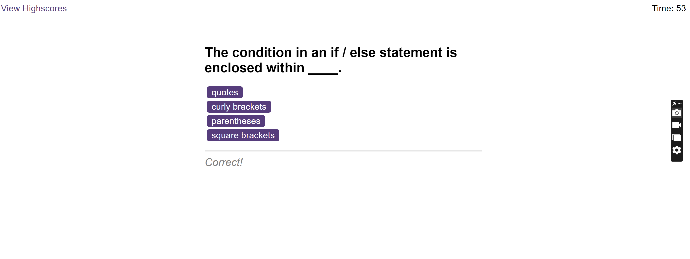

# Timed Coding Quiz

## Description
This web application has been created for students to challenge their coding knowledge. The app can be reach through this <a href="https://hazalsigic.github.io/Timed-Quiz/" target="_blank">link</a>.

## Installation
N/A

## Visuals

## Usage
Users can start the quiz by clicking the start utton. When the button is clicked, the timer starts counting down from 75. If the answer is wrong, the user loses 5 seconds from the timer. When the quiz ends, the score can be stored by submitting the initials and the score table is available on "highscores" section on the left top corner of the page.

## Contributing
N/A

## License
Please refer to the LICENCE in the repo.